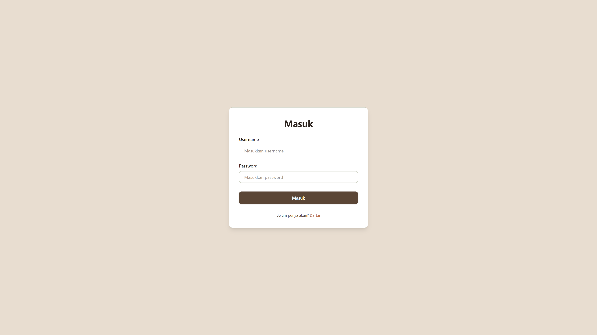
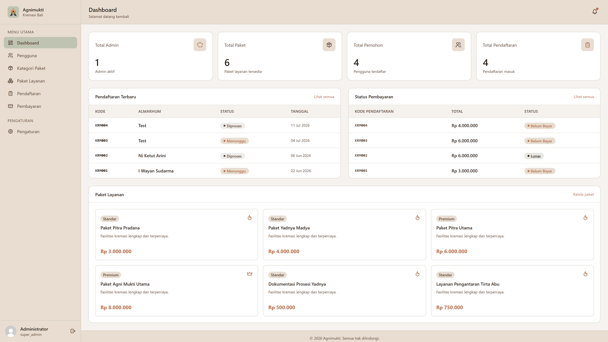
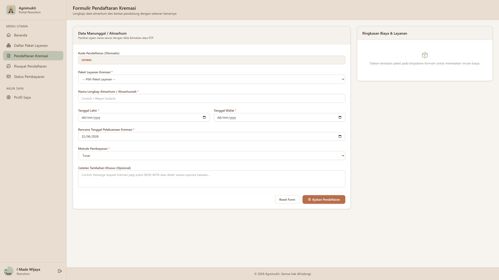

# Agnimukti - Krematorium Digital Bali

Agnimukti adalah sistem informasi berbasis web yang dirancang khusus untuk memfasilitasi manajemen pendaftaran, prosesi, dan administrasi upacara kremasi (krematorium) di Bali secara digital. Sistem ini menghubungkan masyarakat (pemohon) dengan pihak pengelola krematorium secara transparan, mulai dari pemilihan paket layanan, penginputan data almarhum, hingga pelacakan status pembayaran dan prosesi.

---

## Fitur Utama

Agnimukti menyediakan fitur yang disesuaikan berdasarkan peran pengguna (Role-Based Access Control):

1. **Portal Pemohon (Masyarakat)**
   * **Daftar Paket Layanan**: Melihat detail paket kremasi beserta harga dan fasilitas yang ditawarkan.
   * **Pendaftaran Kremasi**: Melakukan pendaftaran upacara kremasi dengan mengisi detail almarhum (nama, tanggal lahir, tanggal meninggal, tanggal pendaftaran) secara online.
   * **Riwayat Pendaftaran**: Melacak pendaftaran yang telah diajukan beserta status terbarunya.
   * **Status Pembayaran**: Memantau tagihan dan metode pembayaran yang dipilih (QRIS, Transfer, Tunai).
   * **Profil & Pengaturan**: Mengubah data diri, mengunggah foto profil, dan mengganti kata sandi.

2. **Portal Admin & Super Admin**
   * **Dashboard**: Visualisasi ringkasan laporan keuangan (total transaksi, lunas, belum bayar) dan statistik pendaftaran.
   * **Manajemen Pengguna (User Management)**: Mengelola data pengguna (Super Admin, Admin, Pemohon) termasuk hak aksesnya.
   * **Manajemen Kategori & Paket Layanan (Khusus Super Admin)**: Mengatur kategori layanan (Standar, Premium, Tambahan) dan mengedit paket layanan beserta detail harga & fasilitas.
   * **Manajemen Pendaftaran**: Melakukan validasi, memperbarui status prosesi (Menunggu, Diproses, Selesai, Dibatalkan), dan menambahkan catatan.
   * **Manajemen Pembayaran**: Melacak transaksi pembayaran, memperbarui status (Belum Bayar, Lunas), dan mencetak bukti pembayaran (`print-payment.php`).
   * **Profil & Pengaturan**: Mengubah informasi profil admin dan memperbarui password.

---

## Teknologi yang Digunakan

* **Backend / Logika Bisnis**: PHP (Object-Oriented Programming - OOP) dengan arsitektur class terpisah.
* **Database / Penyimpanan**: MySQL / MariaDB dengan koneksi menggunakan PDO (PHP Data Objects) untuk keamanan dari SQL Injection.
* **Frontend / UI**:
  * Tailwind CSS (v4 via CDN) untuk antarmuka yang modern dan responsif.
  * Tabler Icons untuk pustaka ikon grafis yang seragam.
  * Vanilla JavaScript untuk interaktivitas menu dinamis dan toggle sidebar.

---

## Struktur Folder

Berikut adalah struktur direktori dari proyek Agnimukti:

```text
agnimukti/
├── classes/                     # File logika Class OOP
│   ├── Auth.php                 # Kelas Autentikasi (Register, Login, Logout, Session)
│   ├── KategoriPaket.php        # Kelas CRUD Kategori Paket Layanan
│   ├── PaketLayanan.php         # Kelas CRUD Paket Layanan Kremasi
│   ├── Pembayaran.php           # Kelas CRUD Transaksi Pembayaran & Laporan Keuangan
│   ├── Pendaftaran.php          # Kelas CRUD Pendaftaran Kremasi & Auto-generate Kode
│   └── Users.php                # Kelas CRUD Pengguna & Pengaturan Profil (Upload Avatar)
├── config/                      # File Konfigurasi
│   └── Database.php             # Koneksi Database menggunakan PDO
├── database/                    # File Skema Database
│   └── db_agnimukti.sql         # Skema tabel dan data dummy awal
├── public/                      # Direktori Publik (Frontend & Routing Halaman)
│   ├── admin/                   # Modul Khusus Admin & Super Admin
│   │   ├── index.php            # Router halaman dashboard admin
│   │   └── pages/               # Tampilan modul admin (dashboard, users, payments, dll.)
│   ├── assets/                  # File Gambar, Logo, Background, dan Uploads
│   │   ├── uploads/             # Folder penyimpanan foto profil pengguna
│   │   └── [gambar-aset]        # Aset gambar bertema Bali/Kremasi
│   ├── user/                    # Modul Khusus Pemohon (Masyarakat)
│   │   ├── index.php            # Router halaman pemohon
│   │   └── pages/               # Tampilan modul pemohon (beranda, pendaftaran, riwayat, dll.)
│   ├── footer.php               # Komponen Footer Halaman Utama
│   ├── header.php               # Komponen Navigation Bar Halaman Utama
│   ├── index.php                # Halaman Landing Page Utama
│   ├── login.php                # Halaman Masuk Akun
│   ├── paket.php                # Halaman Informasi Paket Layanan Publik
│   ├── register.php             # Halaman Pendaftaran Akun Pemohon Baru
│   └── tentang.php              # Halaman Tentang Kami
├── index.php                    # File Entry Point (Redirect ke public/)
└── README.md                    # Dokumentasi Proyek
```

---

## Persyaratan Sistem

Untuk menjalankan proyek ini secara lokal, pastikan sistem Anda memenuhi persyaratan berikut:
* **Web Server**: Apache, Nginx, XAMPP, Laragon, atau sejenisnya.
* **PHP**: Versi 7.4 atau lebih tinggi (sangat disarankan PHP 8.x).
* **Database**: MySQL atau MariaDB.
* **Ekstensi PHP**: `pdo_mysql` diaktifkan di konfigurasi `php.ini`.

---

## Cara Instalasi

1. **Unduh Proyek**:
   Clone atau ekstrak repositori ini ke dalam direktori server lokal Anda (misal `C:\laragon\www\agnimukti` atau `C:\xampp\htdocs\agnimukti`).

2. **Siapkan Database**:
   * Aktifkan MySQL server Anda.
   * Masuk ke phpMyAdmin atau klien database favorit Anda (HeidiSQL, DBeaver, dll.).
   * Buat database baru dengan nama `agnimukti` (atau `db_agnimukti`).

3. **Impor Skema & Data**:
   Impor berkas SQL yang berada di [database/db_agnimukti.sql](file:///c:/laragon/www/agnimukti/database/db_agnimukti.sql) ke dalam database yang baru dibuat.

4. **Konfigurasi Koneksi**:
   Buka berkas konfigurasi database di [config/Database.php](file:///c:/laragon/www/agnimukti/config/Database.php) dan sesuaikan detail koneksi dengan server lokal Anda:
   ```php
   private $host = "localhost";
   private $username = "root";
   private $password = "";
   private $dbname   = "db_agnimukti"; // Sesuaikan dengan nama database Anda
   ```

---

## Cara Menjalankan Project

1. Pastikan Apache/Nginx dan MySQL dalam keadaan aktif pada control panel web server Anda.
2. Buka browser internet Anda dan akses URL proyek sesuai direktori Anda:
   * Jika menggunakan Laragon default: `http://agnimukti.test` atau `http://localhost/agnimukti/`
   * Jika menggunakan XAMPP default: `http://localhost/agnimukti/`
3. Proyek akan secara otomatis mengalihkan Anda ke halaman landing page utama di direktori `public/`.

---

## Konfigurasi Environment

Proyek ini tidak menggunakan file `.env`. Seluruh konfigurasi koneksi database diatur secara terpusat pada file [Database.php](file:///c:/laragon/www/agnimukti/config/Database.php).

---

## Cara Penggunaan

### Kredensial Akun Dummy Default
Di dalam database bawaan `db_agnimukti.sql`, telah disediakan beberapa akun untuk mempermudah pengujian:

| Role | Username | Password |
|---|---|---|
| **Super Admin** | `admin` | `admin` (atau silakan daftarkan user baru/gunakan password terenkripsi) |
| **Pemohon (User 1)** | `madewijaya` | `admin` (atau silakan daftarkan user baru/gunakan password terenkripsi) |
| **Pemohon (User 2)** | `niluhsari` | `admin` (atau silakan daftarkan user baru/gunakan password terenkripsi) |

*(Catatan: Semua akun dummy menggunakan hash password default `$2y$10$nxet7vRO1PmV7AqN5ytvdeZZbKSKfim4t7zU2URMlNYPJYtw.am36` yang terenkripsi)*

### Alur Kerja Utama:
1. **Pendaftaran Akun Baru (Pemohon)**:
   Masyarakat yang belum memiliki akun dapat mengklik tombol **Daftar** di halaman utama dan mengisi form registrasi.
2. **Pengajuan Layanan**:
   Pemohon melakukan login, lalu membuka halaman **Pendaftaran Kremasi** untuk mengisi data almarhum dan memilih jenis paket kremasi yang diinginkan. Setelah disubmit, pendaftaran mendapatkan nomor kode unik seperti `KRM003`.
3. **Konfirmasi & Pemrosesan**:
   Admin masuk ke panel admin, melihat daftar pendaftaran terbaru, dan memperbarui status menjadi **Diproses** serta menentukan detail pembayaran.
4. **Pembayaran**:
   Pemohon melihat status pembayaran di dashboard mereka. Setelah pemohon membayar (melalui Transfer, QRIS, atau Tunai ke pengelola), admin mengonfirmasi pembayaran tersebut menjadi status **Lunas** dan mengubah status pendaftaran menjadi **Selesai** jika upacara kremasi telah tuntas dilaksanakan.

---

## API Endpoint

Proyek ini merupakan aplikasi web monolitik konvensional dan **tidak menyediakan/mengekspos REST API atau API Endpoint publik**. Interaksi data dilakukan langsung melalui instance class OOP PHP di sisi server pada saat me-render halaman.

---

## Database

Skema database terdiri dari 5 tabel utama dengan relasi sebagai berikut:

### 1. Tabel `users`
Menyimpan informasi pengguna sistem.
* `id_user` (INT, Primary Key, Auto Increment)
* `nama` (VARCHAR(100), NOT NULL)
* `foto_url` (TEXT, NOT NULL)
* `username` (VARCHAR(50), NOT NULL, UNIQUE)
* `password` (VARCHAR(255), NOT NULL)
* `role` (ENUM('super_admin', 'admin', 'pemohon'), NOT NULL, DEFAULT 'pemohon')
* `no_telepon` (VARCHAR(20))
* `alamat` (TEXT)
* `created_at` (TIMESTAMP)

### 2. Tabel `kategori_paket`
Menyimpan kategori paket layanan.
* `id_kategori` (INT, Primary Key, Auto Increment)
* `nama_kategori` (VARCHAR(100), NOT NULL)
* `deskripsi` (TEXT)
* `created_at` (TIMESTAMP)

### 3. Tabel `paket_layanan`
Menyimpan paket layanan kremasi yang tersedia.
* `id_paket` (INT, Primary Key, Auto Increment)
* `id_kategori` (INT, Foreign Key ke `kategori_paket`)
* `nama_paket` (VARCHAR(100), NOT NULL)
* `harga` (DECIMAL(12,2), NOT NULL)
* `fasilitas` (TEXT)
* `created_at` (TIMESTAMP)

### 4. Tabel `pendaftaran`
Menyimpan pendaftaran upacara kremasi.
* `id_pendaftaran` (INT, Primary Key, Auto Increment)
* `kode_pendaftaran` (VARCHAR(20), NOT NULL, UNIQUE)
* `id_user` (INT, Foreign Key ke `users`)
* `id_paket` (INT, Foreign Key ke `paket_layanan`)
* `nama_almarhum` (VARCHAR(100), NOT NULL)
* `tanggal_lahir` (DATE)
* `tanggal_meninggal` (DATE)
* `tanggal_daftar` (DATE, NOT NULL)
* `status` (ENUM('Menunggu', 'Diproses', 'Selesai', 'Dibatalkan'), DEFAULT 'Menunggu')
* `catatan` (TEXT)
* `created_at` (TIMESTAMP)

### 5. Tabel `pembayaran`
Menyimpan data transaksi pembayaran untuk pendaftaran.
* `id_pembayaran` (INT, Primary Key, Auto Increment)
* `id_pendaftaran` (INT, Foreign Key ke `pendaftaran`)
* `tanggal_bayar` (DATE, NOT NULL)
* `total_bayar` (DECIMAL(12,2), NOT NULL)
* `metode_pembayaran` (ENUM('Transfer', 'QRIS', 'Tunai'), NOT NULL)
* `status_pembayaran` (ENUM('Belum Bayar', 'Lunas'), DEFAULT 'Belum Bayar')
* `created_at` (TIMESTAMP)

---

## Screenshot / Preview

*Berikut adalah visualisasi antarmuka sistem Agnimukti:*

| Halaman Utama (Landing Page) | Halaman Login Pengguna |
|---|---|
|  |  |

| Dashboard Admin | Form Pendaftaran Kremasi |
|---|---|
|  |  |

---

## Kontributor

### Tim Agnimukti (Krematorium Digital)

- Adi Saputra — GitHub: https://github.com/adisaputra0
- Angga Saputra — GitHub: https://github.com/anggasaputra25
- Putra Krishna — GitHub: https://github.com/PutraKrishna
- Putu Widhyatama — GitHub: https://github.com/Voidxy6475
- Arya Putra — GitHub: https://github.com/AryaPutra-35

---

## Lisensi

Proyek ini dikembangkan untuk keperluan akademik sebagai tugas mata kuliah Pemrograman Web (PWEB).

Hak cipta © 2026 Tim Agnimukti. Seluruh kode sumber dan dokumentasi dalam repositori ini digunakan untuk tujuan pembelajaran, pengembangan, dan evaluasi akademik.

Untuk penggunaan di luar kebutuhan akademik, diharapkan menghubungi pengembang atau kontributor terkait terlebih dahulu.
